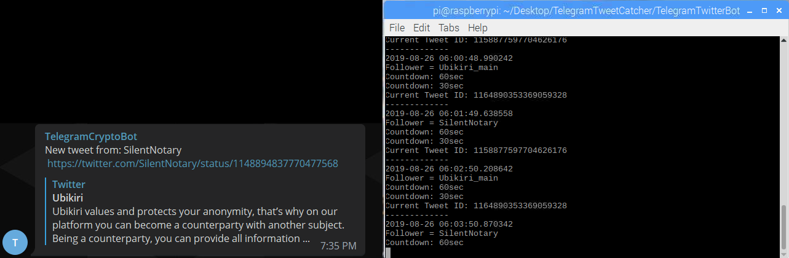

# TelegramTweetCatcher
A Telegram bot that fetches new tweets from an unrestricted list.

# Usage 
- Download and Install the Telegram.ext from https://github.com/python-telegram-bot/python-telegram-bot

- Download and Install the tweepy.ext from https://github.com/tweepy/tweepy/blob/master/docs/index.rst

- Move to directory and use: sudo nano keys.txt (Replace required keys) and sudo nano follow.txt (Add follower ID's)

- Run "screen" to allow for background usage.

- Run sudo Python3 main.py

- The bot will then wait for the command /start from the desired chat

- Once the bot recieves the command it will start listening for tweets using twitters streaming service

# Commands
/Start - Starts the bot and searches for new tweets from the ID list

# Current Plans
:heavy_check_mark: - Done 

# Depiction

