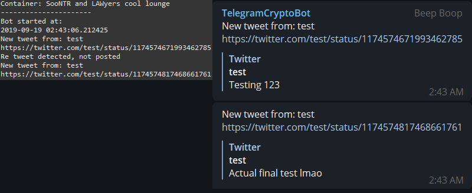

# TelegramTweetCatcher
A Telegram bot that fetches new tweets from an unrestricted list.

# Usage 
- Download and Install the Telegram.ext from https://github.com/python-telegram-bot/python-telegram-bot

- Download and Install the tweepy.ext from https://github.com/tweepy/tweepy/blob/master/docs/index.rst

- Move to directory and use: sudo nano keys.txt (Replace required keys)

- Run "screen" to allow for background usage.

- Run sudo Python3 main.py

- The bot will then wait for the command /start from the desired chat

- Once the bot recieves the command it will ask for a container name to better organize multiple chats

- It will update every 1m 30s and check for new tweets 

# Commands
/Start - Starts the bot and searches for new tweets every 1m 30s, will only post to chat if tweet is new

# Current Plans
This version currently doesnt use twitter's streaming api and relys on simple waits and updates. I'd like to make a seperate version of this app that uses twitter's streaming method. 

# Depiction

